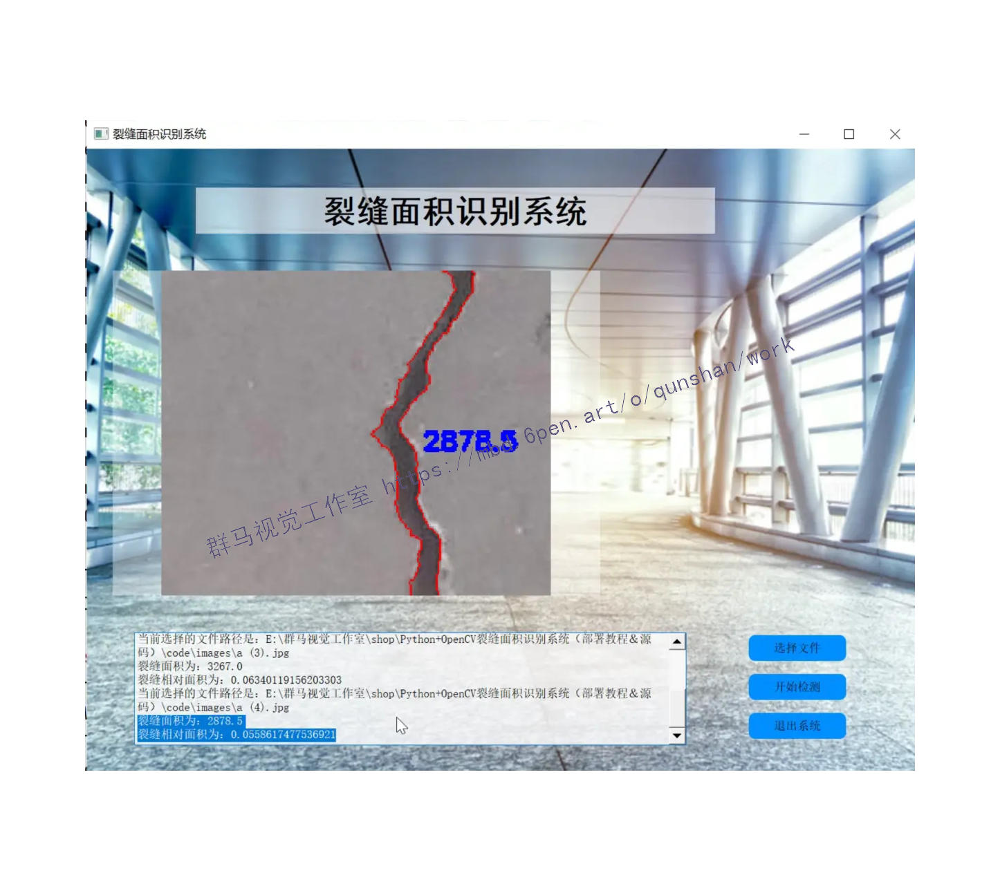
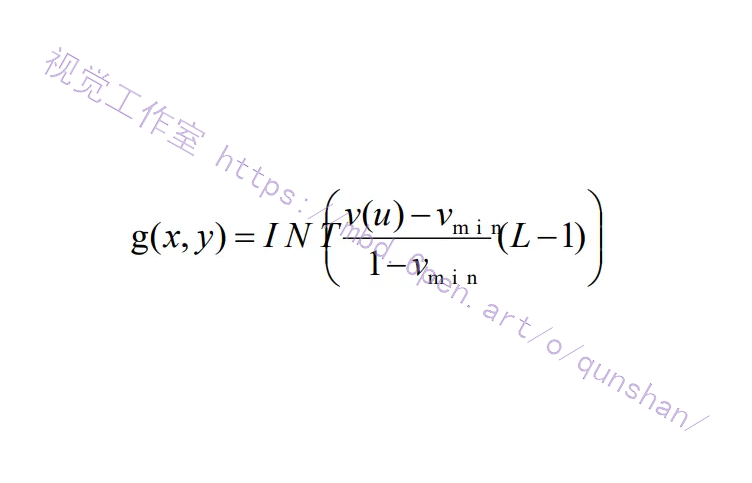
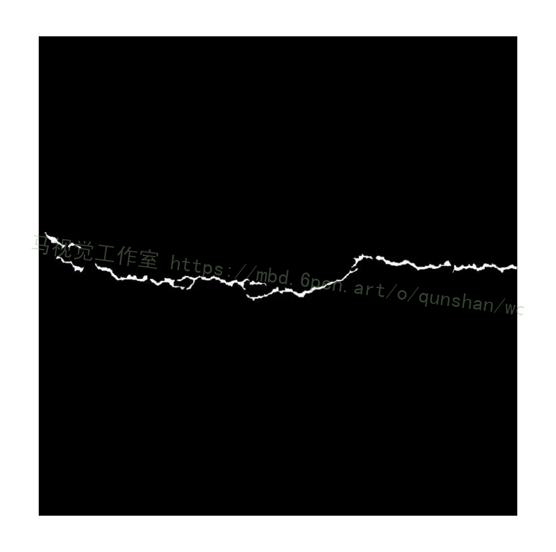

## 1.研究背景与意义


随着科技的不断发展，计算机视觉技术在各个领域中得到了广泛的应用。其中，图像处理是计算机视觉中的一个重要分支，它通过对图像进行数字化处理，提取出其中的有用信息，为后续的分析和应用提供支持。而裂缝面积识别系统是图像处理中的一个重要应用，它可以对裂缝进行自动化的检测和识别，为工程领域中的裂缝维护和修复提供帮助。

裂缝是建筑物和基础设施中常见的问题，它们的存在会对结构的稳定性和安全性产生重大影响。因此，及早发现和修复裂缝是非常重要的。然而，传统的裂缝检测方法通常需要人工参与，费时费力且容易出错。因此，开发一种自动化的裂缝面积识别系统具有重要的意义。

Python是一种简单易学且功能强大的编程语言，而OpenCV是一个开源的计算机视觉库，提供了丰富的图像处理和分析功能。将Python和OpenCV结合起来，可以快速开发出高效的图像处理算法，为裂缝面积识别系统的开发提供了便利。

本研究的目标是开发一个基于Python和OpenCV的裂缝面积识别系统，并提供相应的部署教程和源码。该系统将通过图像处理算法自动检测和识别裂缝，并计算出裂缝的面积。通过该系统，用户可以快速准确地获取裂缝的面积信息，为后续的维护和修复工作提供参考。

本研究的意义主要体现在以下几个方面：

1. 提高工作效率：传统的裂缝检测方法需要人工参与，费时费力且容易出错。而基于Python和OpenCV的裂缝面积识别系统可以实现自动化的裂缝检测和识别，大大提高了工作效率。

2. 提高准确性：人工参与的裂缝检测容易受到主观因素的影响，结果的准确性无法保证。而基于图像处理算法的裂缝面积识别系统可以准确地计算出裂缝的面积，提高了结果的准确性。

3. 降低成本：传统的裂缝检测方法需要大量的人力和时间投入，成本较高。而基于Python和OpenCV的裂缝面积识别系统可以实现自动化的裂缝检测和识别，降低了成本。

4. 推动技术发展：本研究将Python和OpenCV应用于裂缝面积识别系统的开发，为相关领域的技术发展提供了一个实践案例。同时，提供部署教程和源码，可以为其他研究者和开发者提供参考和借鉴。

综上所述，基于Python和OpenCV的裂缝面积识别系统具有重要的研究意义和实际应用价值。通过该系统的开发和推广应用，可以提高工作效率、准确性和降低成本，推动相关领域的技术发展。

# 2.图片演示




# 3.视频演示
[Python+OpenCV裂缝面积识别系统（部署教程＆源码）_哔哩哔哩_bilibili](https://www.bilibili.com/video/BV1Jh4y1D7oi/?vd_source=ff015de2d29cbe2a9cdbfa7064407a08)

# 4.系统流程图
本文通过计算机视觉技术处理图像，期望达到人工检测的效果，满足实际需求，并且避免人工检测存在的效率低、危险及易受人为主观因素影响等不足。路面裂缝检测主要有以下三个方面功能需求:
(1)对一幅路面图像无需人为肉眼辨别，可自动检测有无裂缝并标出裂缝所在区域。(2)对存在裂缝的图像提取出裂缝。
(3)自动识别裂缝类型，并计算相应参数。
因此采用的计算机视觉技术具体流程如图所示。

得到图像后首先要对图像预处理以提高图像质量。灰度化减少图像数据量、提高处理速度;为增强裂缝与背景的对比度，本文对直方图均衡化、分段线性法和 gamma校正处理的效果做了对比，最后选用gamma校正做对比度增强处理;为减少路面非裂缝区的噪声干扰，本文对均值滤波、中值滤波、高斯滤波和双边滤波处理图像的效果做了对比，最后结合路面噪声特性以及各类滤波算法的特性，通过先做中值滤波再做双边滤波完成去噪，降低检测裂缝有无及裂缝提取工作的难度。
预处理后检测图像中有无裂缝，标记有裂缝的区域。训练一个机器学习分类模型，用这个机器学习模型检测图像中是否存在裂缝，实现自动检测功能。通过将图像分成多个小块，检测每个小块中是否存在裂缝，如果存在裂缝，则对这个小块做标记，如果不存在则不做标记，完成裂缝定位工作。
对于存在裂缝的图像，要提取裂缝、识别裂缝类型并计算其相应的参数。通过局部自适应阈值分割算法将裂缝及灰度与裂缝相近的图像块分割出，然后提取图像中连通域轮廓，计算连通域轮廓参数，筛选出裂缝连通域去除噪声连通域。提取出裂缝后识别裂缝类型，本文对投影法识别裂缝类型的方式做了改进，引入面积特征，利用投影特征识别出横向、纵向裂缝，对非横、纵向裂缝图像以一个较大的结构做形态学闭运算后，以此时的裂缝面积作为识别标准识别出斜向、网状裂缝。对线性裂缝计算长度和最大宽度，将裂缝细化提取骨架，统计裂缝骨架上的像素数作为长度，每次腐蚀会剥离裂缝最外面一层，统计完全去除裂缝需要的腐蚀次数，将其乘上2得到裂缝的最大宽度;对网状裂缝计算其分布面积，通过求裂缝凸包面积来近似裂缝分布面积，这种方式优于传统求外接矩形面积来近似裂缝面积的方式。


## 5.核心代码讲解

#### 5.1 CrackDetection.py

下面是封装为类后的代码：

```python

class CrackDetector:
    def __init__(self, input_image_path, output_image_path):
        self.input_image_path = input_image_path
        self.output_image_path = output_image_path

    def detect_cracks(self):
        # Read input image
        img = cv2.imread(self.input_image_path)

        # Convert into gray scale
        gray = cv2.cvtColor(img, cv2.COLOR_BGR2GRAY)

        # Image processing (smoothing)
        blur = cv2.blur(gray, (3, 3))

        # Apply logarithmic transform
        img_log = (np.log(blur + 1) / (np.log(1 + np.max(blur)))) * 255
        img_log = np.array(img_log, dtype=np.uint8)

        # Image smoothing: bilateral filter
        bilateral = cv2.bilateralFilter(img_log, 5, 75, 75)

        # Canny Edge Detection
        edges = cv2.Canny(bilateral, 100, 200)

        # Morphological Closing Operator
        kernel = np.ones((5, 5), np.uint8)
        closing = cv2.morphologyEx(edges, cv2.MORPH_CLOSE, kernel)

        # Create feature detecting method
        orb = cv2.ORB_create(nfeatures=1500)
        ......

```

这个类封装了图像裂缝检测的功能，通过调用`detect_cracks`方法可以进行裂缝检测并保存结果图像。

这个程序文件名为CrackDetection.py，主要功能是对裂纹图像进行裂纹检测。

程序首先导入了必要的库，包括numpy、cv2和matplotlib.pyplot。

然后，程序读取了一个裂纹样本图像，将其转换为灰度图像。

接下来，程序对图像进行了一系列的图像处理操作。首先进行了平滑处理，使用了均值滤波器进行图像平滑。然后，应用了对数变换，将图像进行了对数变换，增强了图像的对比度。接着，使用双边滤波器对图像进行了平滑处理。然后，使用Canny边缘检测算法对图像进行了边缘检测。最后，使用形态学闭运算算子对边缘图像进行了形态学闭运算。

接下来，程序创建了一个特征检测方法，使用了ORB算法进行特征检测。然后，程序使用ORB算法检测并计算了图像的关键点和描述符，并绘制了关键点的特征图像。

最后，程序将输出的特征图像保存为文件，并使用plot函数显示原始图像和输出图像。

#### 5.2 crack_detect_opencv.py

```python

class CrackDetector:
    def __init__(self, image_path):
        self.image_path = image_path
        self.with_nmsup = True
        self.fudgefactor = 1.8
        self.sigma = 21
        self.kernel = 2 * math.ceil(2 * self.sigma) + 1

    def orientated_non_max_suppression(self, mag, ang):
        ang_quant = np.round(ang / (np.pi/4)) % 4
        winE = np.array([[0, 0, 0],[1, 1, 1], [0, 0, 0]])
        winSE = np.array([[1, 0, 0], [0, 1, 0], [0, 0, 1]])
        winS = np.array([[0, 1, 0], [0, 1, 0], [0, 1, 0]])
        winSW = np.array([[0, 0, 1], [0, 1, 0], [1, 0, 0]])

        magE = self.non_max_suppression(mag, winE)
        magSE = self.non_max_suppression(mag, winSE)
        magS = self.non_max_suppression(mag, winS)
        magSW = self.non_max_suppression(mag, winSW)

        mag[ang_quant == 0] = magE[ang_quant == 0]
        mag[ang_quant == 1] = magSE[ang_quant == 1]
        mag[ang_quant == 2] = magS[ang_quant == 2]
        mag[ang_quant == 3] = magSW[ang_quant == 3]
        return mag

    def non_max_suppression(self, data, win):
        data_max = scipy.ndimage.filters.maximum_filter(data, footprint=win, mode='constant')
        data_max[data != data_max] = 0
        return data_max

    def detect_cracks(self):
        gray_image = cv2.imread(self.image_path, 0)

        gray_image = gray_image / 255.0
        blur = cv2.GaussianBlur(gray_image, (self.kernel, self.kernel), self.sigma)
        gray_image = cv2.subtract(gray_image, blur)

        sobelx = cv2.Sobel(gray_image, cv2.CV_64F, 1, 0, ksize=3)
        sobely = cv2.Sobel(gray_image, cv2.CV_64F, 0, 1, ksize=3)
        mag = np.hypot(sobelx, sobely)
        ang = np.arctan2(sobely, sobelx)

        threshold = 4 * self.fudgefactor * np.mean(mag)
        mag[mag < threshold] = 0
        ......

```

这个程序文件是用于检测裂缝的，文件名为crack_detect_opencv.py。它使用了OpenCV库来进行图像处理和计算。主要的功能包括：

1. 导入所需的库和模块。
2. 定义了一个函数orientated_non_max_suppression，用于进行方向非极大值抑制。
3. 定义了一个函数non_max_suppression，用于进行非极大值抑制。
4. 读取灰度图像。
5. 对图像进行预处理，包括应用高斯模糊、减去模糊图像、计算Sobel响应等。
6. 对Sobel响应进行阈值处理。
7. 根据是否应用非极大值抑制，进行不同的处理。
8. 显示处理结果。

整个程序的目的是检测图像中的裂缝，并将结果显示出来。


## 6.系统整体结构

整体功能和构架概括：

这个工程是一个裂缝面积识别系统，主要用于检测和分析图像中的裂缝。它包含了多个程序文件，每个文件负责不同的功能。其中，CrackDetection.py文件用于裂缝检测，crack_detect_opencv.py文件用于裂缝检测和处理，main.py文件用于处理和分析图片中的裂缝，ui.py文件是一个基于PyQt5的图形用户界面程序，用于运行目标检测模型。

下表整理了每个文件的功能：

| 文件名                   | 功能                                                         |
| ------------------------ | ------------------------------------------------------------ |
| CrackDetection.py        | 对裂缝图像进行裂缝检测的程序，包括图像处理和特征检测           |
| crack_detect_opencv.py   | 检测裂缝的程序，使用OpenCV库进行图像处理和计算                |
| main.py                  | 处理和分析图片中的裂缝的程序，包括图像处理、轮廓提取和面积计算 |
| ui.py                    | 基于PyQt5的图形用户界面程序，用于运行裂缝检测模型             |

以上是对每个文件的简要功能概述，每个文件的具体实现可能还包含其他细节和辅助函数。

# 7.图像预处理流程
每个图像都可以视为一个矩阵，图像中的像素就是矩阵中的数，图像中包含了大量的数据。对图像处理需要对矩阵中所有数据处理，计算量非常大，而且图像中目标信息往往比较少，存在大量的无用信息。为了方便后续的裂缝检测提取工作，首先要对采集到的图像做预处理，以提高图像质量。预处理主要分为以下三个方面:
(⑴图像灰度化，将三通道图像变为单通道图像，灰度图保留了彩色图相同的像素亮度信息，且只有单个通道，处理灰度图计算量会大大减少，同时保留了大部分的图像信息，因此本文先对图像灰度化后再做后续处理。
(2)对比度增强，因图像采集设备和采集环境等因素，最初采集到的图像裂缝和背景的对比度较低，要增强对比度。
(3)去噪，路面本身就存在各种不规则的噪声，摄像机获取图像过程中又会引入一些新的噪声，大量的噪声极大的增加了检测提取裂缝的难度，要通过滤波算法减少图像中的噪声干扰。
如图所示是路面图像的预处理流程图。


# 8.直方图均衡化

直方图均衡化就是调整图像中像素灰度直方图中灰度的分布范围，改变原来图像中像素灰度集中在某个区域的现象，让所有像系仕0度值的汜团内均习力，心到本小N图像对比度增强的效果[7]。直方图均衡化本质上就是对原始图像像素分布直方图做非线性拉伸，增大像素的分布范围，属于对图像的一种空域处理方式可以将直方图均衡化对图像的操作做这样的归纳:设f(xy)是点(t,y)处图像的灰度值，g(xy)是处理后的图像的灰度值，像素的范围是О到L-1，这样的一个变化可以通过映射函数得到，这个映射函数必须满足这样两个条件:
(1)当0≤f(x,y)≤L-1时，映射函数是单调函数，保证灰度级的顺序不变，原来怎样的顺序变化后还是这个顺序。
(2)当0≤f(x, y)≤L-1时，满足0≤g(x,y)≤L-1，保证变化后图像像素的范围与之前一样。对原始图做直方图均衡化处理的过程如公式所示。



比较图可以看出，原图像的直方图有明显的峰值，均衡化处理后峰值变得不明显像素分布也变得比较均匀。一幅路面图像其原始图和对其做直方图均衡化的效果如图所示。


# 9.轮廓跟踪与筛选
经局部自适应阈值分割处理后得到一个二值图像，图像中不仅存在裂缝区域，还存在不少噪声块，这些噪声块和裂缝区域一样也属于局部灰度极值点。这些噪声点有的比较大，一般的滤波去噪方式难以去除。本文通过图像中连通域的形状和面积特征筛选出裂缝区域和噪声区域，首先要提取连通域轮廓，然后计算连通域轮廓的圆形度和面积，筛选出裂缝区域。
本文通过OpenCV中提供的 findContours函数提取二值图像中连通域的轮廓，函数findContours的理论依据是文献[54]中提到的算法。文中提到了两种算法对二值图像做拓扑分析，第一种算法用编码的方式确定图像的外层边界、内部孔边界以及内外层边界的层次关系，然后用边界表示原图像。第二种算法基于第一种算法，所求的只是最外层边界。编码的思想是:对不同边界赋不同值，来区别这两个边界及确定层次关系。输入图像是一个二值图像，设f(ij)为图像上像素值，对这个二值图像逐行做扫描当f(ij-1)=0且f(i.j)=1时，把f(i.j)视为外边界的起点，当fi,j)≥1且f(i.j+I)=0时，将f(,y)视为孔边界的起点。将初始边界作为起始位置标记边界像素，当扫描得到一个新的边界点时，为其分配一个标识NBD初始值为1，当遇到fip.q)=l，f(p,q+I)时，将f(p.q)的标识符设为-NBD，这就标志着边界的终止。
用findContours 函数得到轮廓后,将得到的轮廓存储在C++的STL容器Vector中，存储的数据类型是vector<Point>型的，因为每一个跟踪得到的轮廓都是一个个像素点组成的，每个像素点存储在vector里面。得到了这些轮廓之后就要设定一些参数来区分裂缝和噪声，从而筛选出裂缝去掉噪声，设定的参数有:
⑴连通域面积:A
通过opencv中提供的cvContourArea函数可求得连通域轮廓的面积。
(2)圆形度:R
圆形度本质上表示的当前目标形状与圆的相似程度，一般来说越是复杂的边界其圆形度就会越小，圆形度表达式如公式所示。

公式中A表示连通域轮廓的面积,L表示这个连通域轮廓的周长,利用OpenCV
中提供的cvContourPerimeter函数能得到连通域轮廓的周长。根据上式可以看出，目标越接近圆那么它的圆形度就越大，如果目标为圆形那它的圆形度就是1。
本文通过这两个参数来筛选连通域区分裂缝和噪声，最后将裂缝保留去掉噪声。对于裂缝，它的连通域的轮廓应该满足以下条件:
(1)面积比较大。通过之前的分割处理，留下的噪声点大多数面积会比较小，相对来说裂缝区域面积就比较大。
(2)圆形度较小。裂缝区域连通域的轮廓会比较复杂、不规则，某种程度上会显示出一定的线性特点，圆形度就比较小;而噪声在多数情况下是块状的，这样圆形度就比较大。
最后将删除了噪声后保留下来的轮廓重新绘制到一个新的图像上，用OpenCV中的drawContours 函数绘制轮廓。本文设定的圆形度是0.25,将圆形度大于0.25连通域删去，本文设定的面积参数取的是50个像素，将面积小于50个像素的连通域去掉，最后得到的结果如图所示。


# 10.系统整合
下图[完整源码＆环境部署视频教程＆数据集＆自定义UI界面](https://s.xiaocichang.com/s/b75104)


参考博客[《Python+OpenCV裂缝面积识别系统（部署教程＆源码）》](https://mbd.pub/o/qunshan/work)


# 11.参考文献
---
[1][张磊](https://s.wanfangdata.com.cn/paper?q=%E4%BD%9C%E8%80%85:%22%E5%BC%A0%E7%A3%8A%22).[基于图像处理的公路路面裂缝检测技术研究](https://d.wanfangdata.com.cn/periodical/jxsjyzzgc201702019)[J].[机械设计与制造工程](https://sns.wanfangdata.com.cn/perio/jxsjyzzgc).2017,(2).DOI:10.3969/j.issn.2095-509X.2017.02.019.

[2][朱力强](https://s.wanfangdata.com.cn/paper?q=%E4%BD%9C%E8%80%85:%22%E6%9C%B1%E5%8A%9B%E5%BC%BA%22),[王春薇](https://s.wanfangdata.com.cn/paper?q=%E4%BD%9C%E8%80%85:%22%E7%8E%8B%E6%98%A5%E8%96%87%22),[王耀东](https://s.wanfangdata.com.cn/paper?q=%E4%BD%9C%E8%80%85:%22%E7%8E%8B%E8%80%80%E4%B8%9C%22),等.[基于特征点集距离描述的裂缝图像匹配算法研究](https://d.wanfangdata.com.cn/periodical/yqyb201612026)[J].[仪器仪表学报](https://sns.wanfangdata.com.cn/perio/yqyb).2016,(12).

[3][钱彬](https://s.wanfangdata.com.cn/paper?q=%E4%BD%9C%E8%80%85:%22%E9%92%B1%E5%BD%AC%22),[唐振民](https://s.wanfangdata.com.cn/paper?q=%E4%BD%9C%E8%80%85:%22%E5%94%90%E6%8C%AF%E6%B0%91%22),[沈肖波](https://s.wanfangdata.com.cn/paper?q=%E4%BD%9C%E8%80%85:%22%E6%B2%88%E8%82%96%E6%B3%A2%22),等.[基于多特征流形学习和矩阵分解的路面裂缝检测](https://d.wanfangdata.com.cn/periodical/yqyb201607025)[J].[仪器仪表学报](https://sns.wanfangdata.com.cn/perio/yqyb).2016,(7).DOI:10.3969/j.issn.0254-3087.2016.07.025.

[4][张宏](https://s.wanfangdata.com.cn/paper?q=%E4%BD%9C%E8%80%85:%22%E5%BC%A0%E5%AE%8F%22),[英红](https://s.wanfangdata.com.cn/paper?q=%E4%BD%9C%E8%80%85:%22%E8%8B%B1%E7%BA%A2%22).[频域滤波的水泥路面图像降噪增强方法](https://d.wanfangdata.com.cn/periodical/cqjzdxxb201503007)[J].[土木建筑与环境工程](https://sns.wanfangdata.com.cn/perio/cqjzdxxb).2015,(3).DOI:10.11835/j.issn.1674-4764.2015.03.007.

[5][李爱霞](https://s.wanfangdata.com.cn/paper?q=%E4%BD%9C%E8%80%85:%22%E6%9D%8E%E7%88%B1%E9%9C%9E%22),[管海燕](https://s.wanfangdata.com.cn/paper?q=%E4%BD%9C%E8%80%85:%22%E7%AE%A1%E6%B5%B7%E7%87%95%22),[钟良](https://s.wanfangdata.com.cn/paper?q=%E4%BD%9C%E8%80%85:%22%E9%92%9F%E8%89%AF%22),等.[基于张量投票的道路表面裂缝检测](https://d.wanfangdata.com.cn/periodical/yykxxb201505008)[J].[应用科学学报](https://sns.wanfangdata.com.cn/perio/yykxxb).2015,(5).DOI:10.3969/j.issn.0255-8297.2015.05.008.

[6][姒绍辉](https://s.wanfangdata.com.cn/paper?q=%E4%BD%9C%E8%80%85:%22%E5%A7%92%E7%BB%8D%E8%BE%89%22),[胡伏原](https://s.wanfangdata.com.cn/paper?q=%E4%BD%9C%E8%80%85:%22%E8%83%A1%E4%BC%8F%E5%8E%9F%22),[顾亚军](https://s.wanfangdata.com.cn/paper?q=%E4%BD%9C%E8%80%85:%22%E9%A1%BE%E4%BA%9A%E5%86%9B%22),等.[一种基于不规则区域的高斯滤波去噪算法](https://d.wanfangdata.com.cn/periodical/jsjkx201411062)[J].[计算机科学](https://sns.wanfangdata.com.cn/perio/jsjkx).2014,(11).DOI:10.11896/j.issn.1002-137X.2014.11.062.

[7][杨洋](https://s.wanfangdata.com.cn/paper?q=%E4%BD%9C%E8%80%85:%22%E6%9D%A8%E6%B4%8B%22),[王卫星](https://s.wanfangdata.com.cn/paper?q=%E4%BD%9C%E8%80%85:%22%E7%8E%8B%E5%8D%AB%E6%98%9F%22).[基于差分计盒法和数学形态学的路面裂缝分割和提取方法](https://d.wanfangdata.com.cn/periodical/kxjsygc201323017)[J].[科学技术与工程](https://sns.wanfangdata.com.cn/perio/kxjsygc).2013,(23).DOI:10.3969/j.issn.1671-1815.2013.23.017.

[8][李小红](https://s.wanfangdata.com.cn/paper?q=%E4%BD%9C%E8%80%85:%22%E6%9D%8E%E5%B0%8F%E7%BA%A2%22),[谢成明](https://s.wanfangdata.com.cn/paper?q=%E4%BD%9C%E8%80%85:%22%E8%B0%A2%E6%88%90%E6%98%8E%22),[贾易臻](https://s.wanfangdata.com.cn/paper?q=%E4%BD%9C%E8%80%85:%22%E8%B4%BE%E6%98%93%E8%87%BB%22),等.[基于ORB特征的快速目标检测算法](https://d.wanfangdata.com.cn/periodical/dzclyyqxb201305011)[J].[电子测量与仪器学报](https://sns.wanfangdata.com.cn/perio/dzclyyqxb).2013,(5).DOI:10.3724/SP.J.1187.2013.00455.

[9][XU Xue-jun](https://s.wanfangdata.com.cn/paper?q=%E4%BD%9C%E8%80%85:%22XU%20Xue-jun%22),[ZHANG Xiao-ning](https://s.wanfangdata.com.cn/paper?q=%E4%BD%9C%E8%80%85:%22ZHANG%20Xiao-ning%22).[Crack detection of reinforced concrete bridge using video image](https://d.wanfangdata.com.cn/periodical/zngydxxb-e201309033)[J].[中南大学学报（英文版）](https://sns.wanfangdata.com.cn/perio/zngydxxb-e).2013,(9).DOI:10.1007/s11771-013-1775-5.

[10][黎蔚](https://s.wanfangdata.com.cn/paper?q=%E4%BD%9C%E8%80%85:%22%E9%BB%8E%E8%94%9A%22),[高璐](https://s.wanfangdata.com.cn/paper?q=%E4%BD%9C%E8%80%85:%22%E9%AB%98%E7%92%90%22).[基于改进的分水岭算法的路面裂缝检测](https://d.wanfangdata.com.cn/periodical/jsjgcyyy201320059)[J].[计算机工程与应用](https://sns.wanfangdata.com.cn/perio/jsjgcyyy).2013,(20).DOI:10.3778/j.issn.1002-8331.1210-0221.


---
#### 如果您需要更详细的【源码和环境部署教程】，除了通过【系统整合】小节的链接获取之外，还可以通过邮箱以下途径获取:
#### 1.请先在GitHub上为该项目点赞（Star），编辑一封邮件，附上点赞的截图、项目的中文描述概述（About）以及您的用途需求，发送到我们的邮箱
#### sharecode@yeah.net
#### 2.我们收到邮件后会定期根据邮件的接收顺序将【完整源码和环境部署教程】发送到您的邮箱。
#### 【免责声明】本文来源于用户投稿，如果侵犯任何第三方的合法权益，可通过邮箱联系删除。